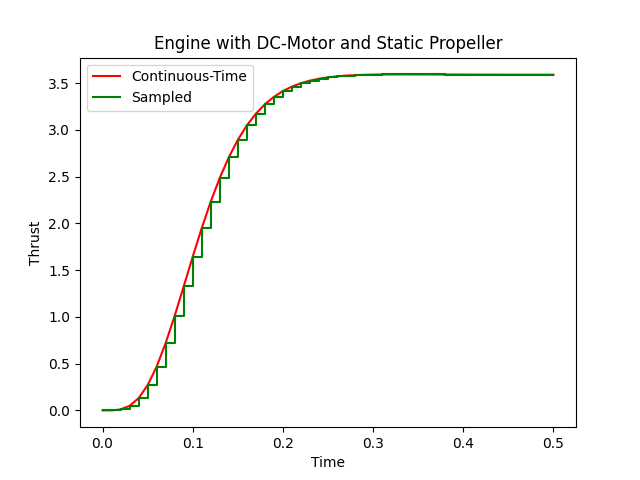

.. image:: https://badge.fury.io/py/modypy.svg
    :alt: PyPi Version

.. image:: https://img.shields.io/pypi/pyversions/modypy
    :alt: PyPI - Python Version

.. image:: https://img.shields.io/github/license/modypy/modypy
    :alt: GitHub

.. image:: https://travis-ci.com/modypy/modypy.svg?branch=master
    :alt: Build Status
    :target: https://travis-ci.com/modypy/modypy

.. image:: https://readthedocs.org/projects/modypy/badge/
    :alt: ReadTheDocs Build Status
    :target: https://modypy.readthedocs.io/

.. image:: https://codecov.io/gh/modypy/modypy/branch/master/graph/badge.svg
    :alt: Code Coverage
    :target: https://codecov.io/gh/modypy/modypy

.. image:: https://www.code-inspector.com/project/17342/score/svg
    :alt: Code Quality Store

.. image:: https://www.code-inspector.com/project/17342/status/svg
    :alt: Code Grade

MoDyPy (rhymes with "modify") is a Python framework for *Mo*\ delling *dy*\ namic
systems in *Py*\ thon. The framework provides methods for describing continuous-time
linear and non-linear systems in
`state-space representation <https://en.wikipedia.org/wiki/State-space_representation>`_.
It was originally inspired by `simupy <https://github.com/simupy/simupy>`_
developed by Ben Margolis, but has a completely different philosophy and
architecture than simupy.

The basic components of a dynamic system in MoDyPy are states and signals.
States represent the internal state of the system, and signals represent the
values calculated based on the state. Ports can be connected to signals, so that
reusable blocks with input and output ports can be easily built. For more
details refer to the `documentation <https://modypy.org/>`_.

Main Features
-------------

- Simple architecture based on states, signals and connectible ports
- Enables hierarchical modelling
- Allows the establishment of reusable building blocks
- Simulator for linear and non-linear continuous- and discrete-time systems
- Clock system to model periodic events and discrete-time components
- Steady state determination and linearization
- Library of standard blocks, including 6-degree-of-freedom rigid body motion
- Tested for 100% statement and branch coverage

Installation
------------

MoDyPy is available via the *pip* installer:

.. code-block:: bash

  $ pip install modypy

To install the development version,

.. code-block:: bash

  $ git clone https://github.com/ralfgerlich/modypy.git
  $ pip install -e modypy

Examples
--------

    Simulation of a DC-motor with propeller

Check out the examples in the
`examples directory <https://github.com/ralfgerlich/modypy/tree/master/examples>`_
and the `User's Guide <https://modypy.org/>`_. These include:

`dcmotor.py <https://github.com/ralfgerlich/modypy/tree/master/examples/dcmotor.py>`_
    A simple example using a DC-motor driving a propeller and sampling the
    thrust using a zero-order hold.
`rigidbody.py <https://github.com/ralfgerlich/modypy/tree/master/examples/rigidbody.py>`_
    Some rigid-body simulation using moments and forces showing an object
    moving in a circle with constant velocity and turn-rate.
`bouncing_ball.py <https://github.com/ralfgerlich/modypy/tree/master/examples/bouncing_ball.py>`_
    An example modelling a bouncing ball, demonstrating the use of events and
    event-handler functions.
`quadcopter_trim.py <https://github.com/ralfgerlich/modypy/tree/master/examples/quadcopter_trim.py>`_
    A larger example showcasing the steady-state-determination and linearisation
    of complex systems, in this case for a quadrocopter frame with four
    DC-motors with propellers.

They can be run from the sources using, e.g.,

.. code-block:: bash

  $ pip install matplotlib
  $ python examples/bouncing_ball.py

Note that some of the examples require ``matplotlib`` to run and display the
results.

Contributing
------------

Contributions are welcome! Check out the
`GitHub Project Page <https://github.com/ralfgerlich/modypy>`_ for issues and
ideas on how to add to the project.

Contributions must adhere to the following conditions:

- New features must be accompanied by appropriate pytest tests.
- New features should at least carry Python Docstrings for API documentation
  following the general style of the existing API documentation.
- Coding style should adhere to
  `PEP8 <https://www.python.org/dev/peps/pep-0008/>`_ as per the settings of the
  ``pylintrc`` file in the project directory.
- Contributors must accept publishing their contribution under the licensing
  conditions laid out in the ``LICENSE`` file.
