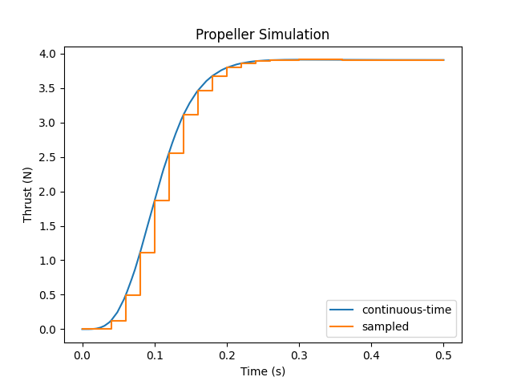

.. image:: https://badge.fury.io/py/modypy.svg
    :alt: PyPi Version

.. image:: https://travis-ci.com/ralfgerlich/modypy.svg?branch=master
    :alt: Build Status
    :target: https://travis-ci.com/ralfgerlich/modypy

.. image:: https://codecov.io/gh/ralfgerlich/modypy/branch/master/graph/badge.svg
    :alt: Cove Coverage
    :target: https://codecov.io/gh/ralfgerlich/modypy

.. image:: https://www.code-inspector.com/project/17342/score/svg
    :alt: Code Quality Store

.. image:: https://www.code-inspector.com/project/17342/status/svg
    :alt: Code Grade

MoDyPy (rhymes with "modify") is a Python framework for *Mo*\ delling *dy*\ namic
systems in *Py*\ thon. The framework provides methods for describing continuous-time
linear and non-linear systems in
`state-space representation <https://en.wikipedia.org/wiki/State-space_representation>`_.
It was originally inspired by `simupy <https://github.com/simupy/simupy>`_
developed by Ben Margolis, but has a completely different philosophy and
architecture than simupy.

The basic components of a dynamic system in MoDyPy are states and signals.
States represent the internal state of the system, and signals represent the
values calculated based on the state. Ports can be connected to signals, so that
reusable blocks with input and output ports can be easily built. For more
details refer to the `API documentation <https://modypy.readthedocs.io/>`_.

For example, a simple combination of a DC-motor and a propeller can be built
as follows:

.. code-block:: python

    import matplotlib.pyplot as plt

    from modypy.blocks.aerodyn import Propeller
    from modypy.blocks.discrete import zero_order_hold
    from modypy.blocks.elmech import DCMotor
    from modypy.blocks.sources import constant
    from modypy.model import System, Clock
    from modypy.simulation import Simulator
    from modypy.utils.uiuc_db import load_static_propeller

    # Import thrust and torque coefficients from the UIUC propeller database
    thrust_coeff, torque_coeff = \
        load_static_propeller(
            'volume-1/data/apcsf_8x3.8_static_2777rd.txt',
            interp_options={
                "bounds_error": False,
                "fill_value": "extrapolate"
            }
        )

    system = System()

    # Create the engine, consisting of the motor and a propeller
    dcmotor = DCMotor(system,
                      Kv=789.E-6,
                      R=43.3E-3,
                      L=1.9E-3,
                      J=5.284E-6)
    propeller = Propeller(system,
                          thrust_coeff=thrust_coeff,
                          power_coeff=torque_coeff,
                          diameter=8*25.4E-3)

    # Connect the motor and propeller to each other
    propeller.torque.connect(dcmotor.external_torque)
    dcmotor.speed_rps.connect(propeller.speed_rps)

    # Create the sources for voltage and air density
    voltage = constant(system, value=3.5)
    density = constant(system, value=1.29)

    # Connect the voltage to the motor
    voltage.connect(dcmotor.voltage)
    # Connect the density to the propeller
    density.connect(propeller.density)

    # We want to monitor the sampled thrust
    sample_clock = Clock(system, period=1/50.0)
    thrust_sampler = zero_order_hold(system,
                                     input_port=propeller.thrust,
                                     clock=sample_clock)

    # Run a simulation for 1/2s
    simulator = Simulator(system=system, start_time=0)
    simulator.run_until(t_bound=0.5)

    # Plot the thrust output over time
    fig, ax = plt.subplots()
    ax.plot(simulator.result.time,
            simulator.result.signals[:, propeller.thrust.signal_slice],
            label="continuous-time")
    ax.step(simulator.result.time,
            simulator.result.signals[:, thrust_sampler.signal_slice],
            label="sampled")

    ax.set_title("Propeller Simulation")
    ax.legend()
    ax.set_xlabel("Time (s)")
    ax.set_ylabel("Thrust (N)")
    fig.savefig("propeller.png")
    plt.show()

Main Features
=============

- Simple architecture based on states, signals and connectible ports
- Enables hierarchical modelling
- Allows the establishment of reusable building blocks
- Simulator for linear and non-linear continuous-time systems
- Clock system to model periodic events and discrete-time components
- Steady state determination and linearization
- Library of standard blocks, including 6-degree-of-freedom rigid body motion
- Tested for 100% statement and branch coverage

Installation
============

MoDyPy is available via the *pip* installer:

.. code-block:: bash

  $ pip install modypy

To install the development version,

.. code-block:: bash

  $ git clone https://github.com/ralfgerlich/modypy.git
  $ pip install -e modypy

Examples
========

Check out the examples in the ``examples`` directory:

``dcmotor.py``
    A simple example using a DC-motor driving a propeller and sampling the
    thrust using a zero-order hold.
``rigidbody.py``
    Some rigid-body simulation using moments and forces showing an object
    moving in a circle with constant velocity and turn-rate.
``bouncing_ball.py``
    An example modelling a bouncing ball, demonstrating the use of events and
    event-handler functions.
``quadcopter_trim.py``
    A larger example showcasing the steady-state-determination and linearisation
    of complex systems, in this case for a quadrocopter frame with four
    DC-motors with propellers.

They can be run from the sources using, e.g.,

.. code-block:: bash

  $ pip install matplotlib
  $ python examples/bouncing_ball.py

Note that some of the examples require ``matplotlib`` to run and display the
results.
