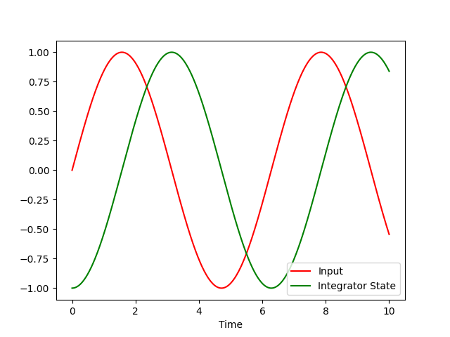

Single States: A Simple Integrator
==================================

As our first model, we will describe a simple integrator with a cosine wave
input.
As output we should get a sine wave.
After this exercise, you will know

- how to create a system,
- how to add states to it,
- how to run a simulation of the system, and
- how to access simulation results.

An integrator is a very simple dynamic element with a single state
:math:`x\left(t\right)`.
The derivative :math:`\frac{d}{dt} x\left(t\right)` of that state is just the
input into the system.
In addition to the derivative, we need to specify the initial value of the state
:math:`x\left(t_0\right)`:

.. math::
    x\left(t_0\right) &= x_0 \\
    \frac{d}{dt} x\left(t\right) &= u\left(t\right)

To view our results, we will use ``matplotlib``, so we install that first:

.. code-block:: bash

    $ pip install matplotlib

Now let us code our model.
We start by importing the relevant declarations:

.. code-block:: python

    import numpy as np
    import matplotlib.pyplot as plt

    from modypy.model import System, State, signal_function
    from modypy.simulation import Simulator

Defining the System
-------------------

All models in ``modypy`` are contained in a
:class:`System <modypy.model.system.System>`, so we need to create an instance:

.. code-block:: python

    system = System()

Now we can add states and other elements to that system.
Let us first define a function that will calculate the value of our input and
turn it into a signal:

.. code-block:: python

    # Define the cosine signal
    @signal_function(shape=1)
    def cosine_input(system_state):
        """Calculate the value of the input signal"""
        return np.cos(system_state.time)

In our case, the signal is defined by a simple function that accepts the
*system state*.
That system state provides the current time, i.e., the time at which the signal
is being evaluated.
That time may be a scalar (when evaluating the signal at a single point in time)
or a vector of times (when evaluating the signal at multiple points in time).

However, signals in modypy are actually instances of the
:class:`Signal <modypy.model.ports.Signal>` class, which provides some
additional information and functionality over normal callables.
In order to turn our function into a signal instance, we use the
:func:`signal_function <modypy.model.ports.signal_function>` decorator.

Now we need to create the integrator.
We can simply specify the signal we just created as the derivative function:

.. code-block:: python

    integrator_state = State(system,
                             shape=1,
                             derivative_function=cosine_input)

The state itself also is a scalar, so it has the same shape as our signal.
Note that signals and states by default are scalar, so you could as well remove
the ``shape`` parameter.

The ``derivative_function`` is the callable that gives our time derivative of
our state.
In our case, this is simply the current value of our input signal.

Running a Simulation
--------------------

Now, our system is already complete.
We have our signal source and our integrator state.
Let's have a look at the motion of our system.
For that, we create a :class:`Simulator <modypy.simulation.Simulator>`:

.. code-block:: python

    simulator = Simulator(system,
                          start_time=0.0)

We set the start time for the simulation to ``0``.
To run the simulation, we have to call ``run_until``:

.. code-block:: python

    simulator.run_until(time_boundary=10.0)

The ``time_boundary`` parameter gives the time until that the simulation should
be run.
In our case, we want the simulation to run for ten time-units.
You can think of this as seconds, but if your system is expressed in the proper
units, these can also be minutes, hours, days, years, or whatever you need to
use.

Plotting the Result
-------------------

We now want to plot the input and the integrator state:

.. code-block:: python

    input_line, integrator_line = \
        plt.plot(simulator.result.time,
                 cosine_input(simulator.result),
                 "r",
                 simulator.result.time,
                 integrator_state(simulator.result)[0],
                 "g")
    plt.legend((input_line, integrator_line), ("Input", "Integrator State"))
    plt.title("Integrator")
    plt.xlabel("Time")
    plt.savefig("01_integrator_simulation.png")
    plt.show()

The result of that simulation can be seen in :numref:`integrator_simulation`.

.. _integrator_simulation:

    Results of integrator simulation: Input and integrator state

In red, we see the input signal, while the value of our integrator state is
plotted in green. Looks quite correct.

But what happened here? We accessed the ``result`` property of our simulator.
This is an instance of :class:`SimulationResult
<modypy.simulation.SimulationResult>`, which can simply be used as a system
state object.
If we use it as a parameter for calling a state or signal object, we get the
time series of the values of that state or signal over the time of the
simulation.

That time series is essentially an array of state or signal values with shape
``(n,k)``, where ``n`` is the shape of the original state or signal, and ``k``
is the number of samples in time that the simulation has produced.
The sampling timestamp for each of the samples can be found in the ``time``
property, which is a one-dimensional array with the index being the
sample-index.

In the example above, we plot both the input signal and the integrator state
against time.
If we wanted, we could do other things with these results, such as checking the
performance of a controller we built against control performance constraints and
many other things.

Using the `integrator` block
-----------------------------------

As integrators are something that we need often, there is a pre-defined building
block for that: :func:`modypy.blocks.linear.integrator`.
In that case, the definition of our integrator is very simple:

.. code-block:: python

    integrator_state = modypy.blocks.linear.integrator(system,
                                                       input_signal=input_signal)

The :func:`integrator <modypy.blocks.linear.integrator>` function returns an
object that is a state and a signal at the same time, and that represents
the integral of the given input signal over time.
