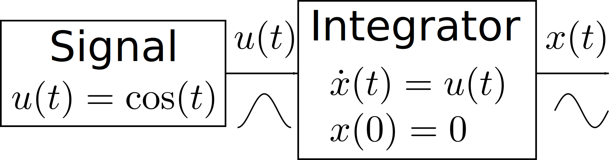
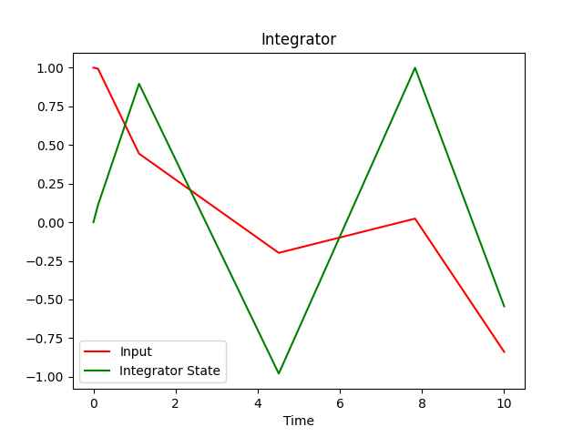

Single States: A Simple Integrator
==================================

As our first model, we will describe a simple integrator with a cosine wave
input.
As output we should get a sine wave.
After this exercise, you will know

- how to create a system,
- how to add states to it,
- how to run a simulation of the system and capture the results, and
- how to access simulation results.

Integrator Theory
-----------------

.. _integrator_schematic:

    Schematic of the integrator

We will build the structure shown in :numref:`integrator_schematic`.
An integrator is a very simple dynamic element that accepts an input
:math:`u\left(t\right)` and for times :math:`t \geq t_0` provides the integral
of the input over time, :math:`x_0 + \int_{t_0}^t u\left(t\right) dt`, as
output.
It has a single state :math:`x\left(t\right)` with an initial value `x_0`
and the input as its derivative over time:

.. math::
    x\left(t_0\right) &= x_0 \\
    \frac{d}{dt} x\left(t\right) &= u\left(t\right)

Preparations
------------

To view our results, we will use ``matplotlib``, so we install that first:

.. code-block:: bash

    $ pip install matplotlib

Coding the Model
----------------

Now let us code our model.
We start by importing the relevant declarations:

.. code-block:: python

    import numpy as np
    import matplotlib.pyplot as plt

    from modypy.model import System, State, signal_function
    from modypy.simulation import Simulator, SimulationResult

All models in ``modypy`` are contained in a
:class:`System <modypy.model.system.System>`, so we need to create an instance:

.. code-block:: python

    system = System()

Now we can add states and other elements to that system.
Let us first define a function that will calculate the value of our input and
turn it into a signal:

.. code-block:: python

    # Define the cosine signal
    @signal_function
    def cosine_input(system_state):
        """Calculate the value of the input signal"""
        return np.cos(system_state.time)

Signals are defined by callables that accept the *system state* as their only
parameter.
System state objects implement a certain protocol, so that whenever we have a
system state object, we can use it in the same way.
For example, system state objects have a property ``time``.
The value of that property can either be

- a *scalar*, in which case the system state object represents the state of the
  system at a single point in time, or it can be
- a *vector*, in which case the system state object represents the state of the
  system at multiple points in time.

In our case, :func:`numpy.cos` will handle both cases, and return either the
cosine of the single number, or a vector of cosines of all the numbers given.

However, signals in modypy are actually instances of the
:class:`Signal <modypy.model.ports.Signal>` class, which provides some
additional information and functionality over normal callables.
In order to turn our function into a signal instance, we use the
:func:`signal_function <modypy.model.ports.signal_function>` decorator.

As we will see in later steps of this guide, signals can be scalar --- as in our
case --- or they can be multi-dimensional with a defined
`shape <https://numpy.org/devdocs/reference/arrays.ndarray.html>`_.
The default --- as created by the
:func:`signal_function <modypy.model.ports.signal_function>` decorator, however,
is a :doc:`scalar <numpy:reference/arrays.scalars>`,
which has the empty shape `()`.

Now we need to create the integrator.
We can simply specify the signal we just created as the derivative function:

.. code-block:: python

    integrator_state = State(system,
                             derivative_function=cosine_input)

As for signals, a state may have a shape, and the default shape is the scalar.

The ``derivative_function`` is the callable that gives our time derivative of
our state.
In our case, this is simply the current value of our input signal.

Running a Simulation
--------------------

Now, our system is already complete.
We have our signal source and our integrator state.
Let's have a look at the motion of our system.
For that, we create a :class:`Simulator <modypy.simulation.Simulator>`:

.. code-block:: python

    simulator = Simulator(system, start_time=0.0)

We set the start time for the simulation to ``0``.
To run the simulation, we have to call ``run_until``.
That will return a generator that will provide a tuple of time, inputs and
state values for each of the samples generated during simulation.
One thing we can do with that is simply output the value of the individual
samples:

.. code-block:: python

    for state in simulator.run_until(time_boundary=10.0):
        print("time=%.7f cosine_input=%f integrator_state=%f" % (
            state.time,
            cosine_input(state),
            integrator_state(state)
        ))

The ``time_boundary`` parameter gives the time until that the simulation should
be run, which in our case are 10 time-units.
You can think of this as seconds, but if your system is expressed in the proper
units, these can also be minutes, hours, days, years, or whatever you need to
use.

Also note how we are again using the signal and the state as callables on the
value returned by the `run_until` generator.
This pattern will re-occur all the time in `MoDyPy`:
We treat signals, states, events, derivatives, etc. as functions of the system
state.

This should give us a long output similar to this:

.. code-block::

    time=0.0000000 cosine_input=1.000000 integrator_state=0.000000
    time=0.0001000 cosine_input=1.000000 integrator_state=0.000100
    time=0.0011000 cosine_input=0.999999 integrator_state=0.001100
    time=0.0111000 cosine_input=0.999938 integrator_state=0.011100
    time=0.1111000 cosine_input=0.993835 integrator_state=0.110872
    time=1.1111000 cosine_input=0.443676 integrator_state=0.896187
    time=4.5126489 cosine_input=-0.198415 integrator_state=-0.980153
    time=7.8306242 cosine_input=0.023355 integrator_state=0.999722
    time=10.0000000 cosine_input=-0.839072 integrator_state=-0.544027

However, that's not very informative and also quite boring, so we'd rather have
a plot of all of this.

Plotting the Result
-------------------

To plot the data, we need to capture all of it.
One way of doing that is to use a
:class:`SimulationResult <modypy.simulation.SimulationResult>` object, which can
be used in place of a system state object to access signals, states, etc.

However, simply re-running `run_until` with the same boundary now would not give
us any data, as the simulation time of the simulator has already advanced to our
time limit.

So, let's remove the code for dumping all the data to the console and instead
use the following code:

.. code-block:: python

    # Run the simulation for 10s and capture the result
    result = SimulationResult(system, simulator.run_until(time_boundary=10.0))

    # Plot the result
    input_line, integrator_line = \
        plt.plot(result.time, cosine_input(result), "r",
                 result.time, integrator_state(result), "g")
    plt.legend((input_line, integrator_line), ("Input", "Integrator State"))
    plt.title("Integrator")
    plt.xlabel("Time")
    plt.savefig("01_integrator_simulation.png")
    plt.show()

The result of that simulation can be seen in
:numref:`integrator_simulation_coarse`.

.. _integrator_simulation_coarse:

    Results of integrator simulation: Input and integrator state

That looks a bit rough around the edges.
The reason is simple:
The simulator works using numerical approximations, and chooses the step size as
large as possible without the numerical error exceeding a given threshold.
In case of our example, this step size can be pretty large --- one of the steps
covers nearly 4 time units in the graph.

However, if we wanted the output a bit finer, we could just add a `max_step`
parameter to our :class:`Simulator <modypy.simulation.Simulator>` constructor:

.. code-block:: python

    simulator = Simulator(system, start_time=0.0, max_step=0.1)

So, let's try this again.
The result of this new simulation is now seen in
:numref:`integrator_simulation`.

.. _integrator_simulation:
.. figure:: 01_integrator_simulation.png
    :align: center
    :alt: Results of integrator simulation, maximum step 0.1

    Results of integrator simulation with a maximum step of 0.1

That looks much more smooth.
In red, we see the input signal, while the value of our integrator state is
plotted in green. Looks quite correct.

But what exactly happened here?
The `result` object we created can simply be used as a system state object.
If we use it as a parameter for calling a state or signal object, we get the
time series of the values of that state or signal over the time of the
simulation.

That time series is essentially an array of state or signal values with shape
`n+(k,)`, where `n` is the shape of the original state or signal, and `k`
is the number of samples in time that the simulation has produced.
The sampling timestamp for each of the samples can be found in the ``time``
property, which is a one-dimensional array with the index being the
sample-index.

In the example above, the shape of the input signal and the integrator state are
the empty list `()`, so the respective time series are simply vectors.
Thus, we can easily plot both against time.
If we wanted, we could do other things with these results, such as checking the
performance of a controller we built against control performance constraints and
many other things.

Using the `integrator` block
-----------------------------

As integrators are something that we need often, there is a pre-defined building
block for that: :func:`modypy.blocks.linear.integrator`.
In that case, the definition of our integrator is very simple:

.. code-block:: python

    integrator_state = modypy.blocks.linear.integrator(system,
                                                       input_signal=input_signal)

The :func:`integrator <modypy.blocks.linear.integrator>` function returns an
object that is a state and a signal at the same time, and that represents
the integral of the given input signal over time.
