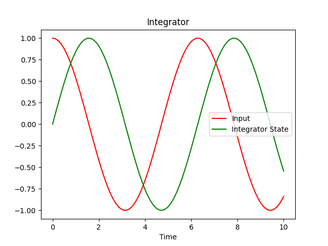

Single States: A Simple Integrator
==================================

As our first model, we will describe a simple integrator with a sine wave input.
As output we should also get a sine wave, just shifted in phase. After this
exercise, you will know

- how to create a system,
- how to add signals and states to it,
- how to run a simulation of the system, and
- how to access simulation results.

An integrator is a very simple dynamic element with a single state
:math:`x\left(t\right)`. The derivative :math:`\frac{d}{dt} x\left(t\right)` of
that state is just the input into the system. In addition to the derivative, we
need to specify the initial value of the state :math:`x\left(t_0\right)`:

.. math::
    x\left(t_0\right) &= x_0 \\
    \frac{d}{dt} x\left(t\right) &= u\left(t\right)

To view our results, we will use ``matplotlib``, so we install that first:

.. code-block:: bash

    $ pip install matplotlib

Now let us code our model. We start by importing the relevant declarations:

.. code-block:: python

    import numpy as np
    import matplotlib.pyplot as plt

    from modypy.model import System, State, Signal
    from modypy.simulation import Simulator

Defining the System
-------------------

All models in ``modypy`` are contained in a
:class:`System <modypy.model.system.System>`, so we need to create an instance:

.. code-block:: python

    system = System()

Now we can add states, signals and other elements to that system. Let us first
define a function that will calculate the value of our input and create a signal
out of it:

.. code-block:: python

    def sine_input(data):
        return np.sin(data.time)

    input_signal = Signal(system,
                          shape=1,
                          value=sine_input)

We add the :class:`signal <modypy.model.ports.Signal>` to ``system`` by
specifying that as the *owner* of the signal. Our signal is a scalar, which is
why we specify a ``shape`` of ``1``. The value is determined by the
``sine_input`` function.

The ``sine_input`` function is passed a data object with a property ``time``
that is set to the current time. We use that to make our input signal change
with time.

Now we need to create the integrator. For that we first provide a function that
calculates the value of the derivative of our state. That function simply
returns the value of our input signal:

.. code-block:: python

    def integrator_dt(data):
        return data[input_signal]

    integrator_state = State(system,
                             shape=1,
                             derivative_function=integrator_dt,
                             initial_condition=-1)

Here, we see another feature of the
data object passed to evaluation functions in ``modypy``: It is a mapping that
can be indexed by states, ports and signals. The value of the expression
``data[input_signal]`` is the current value of the input signal.

The state itself also is a scalar, so it has the same shape as our signal. Note
that signals and states by default are scalar, so you could as well remove the
``shape`` parameter.

The ``initial_condition`` specifies the initial value of the state. This is the
value the state has when the simulation starts. We set it to ``-1`` so that we
get a nice cosine-wave.

The ``derivative_function`` is the function that gives our time derivative of
our state. In our case, this is simply the current value of our input signal.

Running a Simulation
--------------------

Now, our system is already complete. We have our signal source and our integrator
state. Let's have a look at the motion of our system. For that, we create a
:class:`Simulator <modypy.simulation.Simulator>`:

.. code-block:: python

    simulator = Simulator(system,
                          start_time=0.0)

We set the start time for the simulation to ``0``. To run the simulation, we
have to call ``run_until``:

.. code-block:: python

    msg = simulator.run_until(time_boundary=10.0)

The ``time_boundary`` parameter gives the time until that the simulation should
be run. In our case, we want the simulation to run for ten time-units. You can
think of this as minutes, but if your system is expressed in the proper units,
these can also be hours, days, years, or whatever you need to use.

Plotting the Result
-------------------

The result value of the ``run_until`` method is ``None`` when the simulation was
successful and any other value if it failed. In that case, the result value gives
some indication as to the reason for the failure.

We check it and in case of failure print the reason. Otherwise, we want to plot
the input and the integrator state.

.. code-block:: python

    if msg is not None:
        print("Simulation failed with message '%s'" % msg)
    else:
        # Plot the result
        input_line, integrator_line = \
            plt.plot(simulator.result.time,
                     simulator.result[input_signal, 0],
                     "r",
                     simulator.result.time,
                     simulator.result[integrator_state, 0],
                     "g")
        plt.legend((input_line, integrator_line), ("Input", "Integrator State"))
        plt.title("Integrator")
        plt.xlabel("Time")
        plt.savefig("01_integrator_simulation.png")
        plt.show()

The result of that simulation can be seen in :numref:`integrator_simulation`.

.. _integrator_simulation:

    Results of integrator simulation: Input and integrator state

In red, we see the input signal, while the value of our integrator state is
plotted in green. Looks quite correct.

But what happened here? We accessed the ``result`` property of our simulator.
This is an instance of :class:`SimulatorResult
<modypy.simulation.SimulatorResult>`, which - among other aspects - is a mapping
that can be indexed using state, port and signal objects, just as the data
object passed to the derivative function.
The result is the value of the respective state, port or signal over time.
Note that strictly speaking our state and our signal are not scalar, but rather
vectors of dimension 1, which is why we extract the index 0 from both of them
for plotting.
If we didn't do that, ``plot`` would complain about the mismatch in dimensions
between the time vector and the state and state vector, respectively.

The sampling timestamp for each of the samples can be found in the ``time``
property, which is a one-dimensional array with the index being the
sample-index.

In the example above, we plot both the input signal and the integrator state
against time. If we wanted, we could do other things with these results, such
as checking the performance of a controller we built against control performance
constraints and many other things.

Simplifying the Derivative Function
-----------------------------------

Our derivative function is pretty simple:
It just returns the value of our input signal.
For such simple cases, we can make use of the fact that states, ports and
signals are callable.
They expect a data object that satisfies the so-called object access protocol by
implementing methods ``get_port_value``, ``get_state_value`` and another method
``get_event_value``.
The latter is related to events, which we will talk about in the
:doc:`Bouncing Ball <04_bouncing_ball>` example.

The object that is passed to the function during simulation is such an object,
so that we can simply use the input signal as derivative function:

.. code-block:: python

    integrator_state = State(system,
                             shape=1,
                             derivative_function=input_signal,
                             initial_condition=-1)

The result of running the script again should be the same.

As integrators are something that we need often, there is a pre-defined building
block for that: :func:`modypy.blocks.linear.integrator`.
In that case, the definition of our integrator is very simple:

.. code-block:: python

    integrator_state = modypy.blocks.linear.integrator(system,
                                                       input_signal=input_signal,
                                                       initial_condition=-1)

The :func:`integrator function <modypy.blocks.linear.integrator>` returns an
object that is a state and a signal at the same time, and that represents
the integral of the given input signal over time, with the initial value
specified by the ``initial_condition`` parameter.
