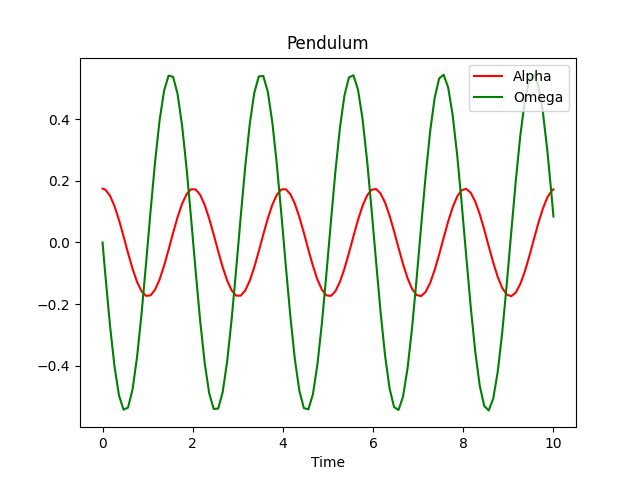

Multiple States: A Pendulum
===========================

In this exercise we will model a simple pendulum:
A mass suspended by a stiff connector from a fixed support.
We will model the angle and angular velocity of the pendulum as states and let
the pendulum move from some initial position.
At the end of this exercise, you will know how to model such a pendulum and by
that will learn how to work with multiple states.

Deriving the Equations
----------------------

In :numref:`pendulum` you can see a schematic drawing of a pendulum just like
the one we are going to model.
We will not consider drag.

.. _pendulum:
.. figure:: 02_pendulum.svg
    :align: center
    :alt: Pendulum with quantities

    Pendulum with mass, length, angle and gravitational force marked

Our pendulum has two states:

- the current angle :math:`\alpha\left(t\right)` and
- the current angular velocity :math:`\omega\left(t\right)`.

Newtonian mechanics tells us that

.. math::
    \frac{d}{dt} \omega\left(t\right) =
    - \frac{g \sin\left(\alpha\left(t\right)\right)}{l}

Our additional equation for the state :math:`\alpha\left(t\right)` comes from
the relationship between position and velocity:

.. math::
    \frac{d}{dt} \alpha\left(t\right) = \omega\left(t\right)

In addition, we have our initial conditions for both of the states:

.. math::
    \alpha\left(t_0\right) & = \alpha_0 \\
    \omega\left(t_0\right) &= \omega_0

Defining our System
-------------------

We will now implement the system described by these equations.
Again we start by importing all necessary definitions.
In addition, we will define some constants for our system:

.. code-block:: python

    import numpy as np
    import matplotlib.pyplot as plt

    from modypy.blocks.linear import integrator
    from modypy.model import System, State
    from modypy.simulation import Simulator

    # Define the system parameters
    LENGTH = 1.0
    GRAVITY = 9.81

    # Define the initial conditions
    ALPHA_0 = np.deg2rad(10)
    OMEGA_0 = 0

Now let us define our system and our two states:

.. code-block:: python

    # Create the system
    system = System()

    # Define the derivatives of the states
    def omega_dt(system_state):
        """Calculate the derivative of the angular velocity"""
        return -GRAVITY/LENGTH * np.sin(alpha(system_state))

    # Create the omega state
    omega = State(system,
                  derivative_function=omega_dt,
                  initial_condition=OMEGA_0)

    # Create the alpha state
    alpha = integrator(system, input_signal=omega, initial_condition=ALPHA_0)

In the previous example, our state derivative function for the integrator only
depended on the input signal.
Here, each of the derivative functions depends on the value of the respective
other state.

States are callables that accept a system state object as their single
parameter.
If called that way, the return value is the value of the state or a time series
of the values of the state, depending on the kind of system state object.
Note that for time series in modypy, the last index iterates over the different
points in time!

Running the Simulation
----------------------

Again, we set up a simulator and run the system for 10 seconds:

.. code-block:: python

    # Run a simulation
    simulator = Simulator(system, start_time=0.0)
    msg = simulator.run_until(time_boundary=10.0)

    if msg is not None:
        print("Simulation failed with message '%s'" % msg)
    else:
        # Plot the result
        alpha_line, omega_line = \
            plt.plot(simulator.result.time,
                     alpha(simulator.result)[0],
                     "r",
                     simulator.result.time,
                     omega(simulator.result)[0],
                     "g")
        plt.legend((alpha_line, omega_line), ("Alpha", "Omega"))
        plt.title("Pendulum")
        plt.xlabel("Time")
        plt.savefig("02_pendulum_simulation.png")
        plt.show()

Note again how we get the time series of the angle and the angular velocity by
simply calling the respective states on the simulation result.
This way of accessing states, signals and the values of other objects in modypy
permeates the whole framework.

The result of that simulation can be seen in :numref:`pendulum_simulation`.

.. _pendulum_simulation:

    Results of pendulum simulation: Angle and angular velocity

Going Further
-------------

If you want, you can now play around with the parameters gravity and length or
the initial states.
For example, you can give the pendulum some initial impulse by setting
``OMEGA_0`` to some value other than 0.

As an additional exercise, try to integrate drag into the system, specified by
the drag coefficient :math:`\gamma` with :math:`\gamma>0`:

.. math::
    \frac{d}{dt} \omega\left(t\right) =
    - \frac{g \sin\left(\alpha\left(t\right)\right)}{l}
    - \gamma \omega\left(t\right)
