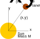
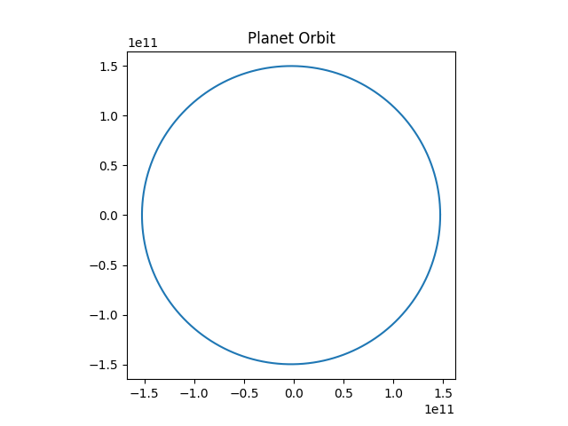
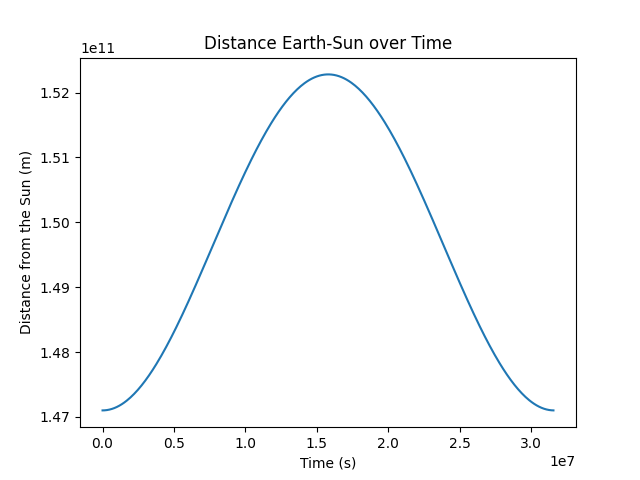

Multi-Dimensional States: A Planet Orbit
========================================

In this exercise we will model the system of a sun and a planet orbiting around
it.
We will model the two-dimensional position and velocity of the planet.
After completing this exercise, you will know

- how to model systems with multi-dimensional states and
- how to specify integrator options.

Deriving the Equations
----------------------

In :numref:`planet_orbit` you can see a schematic drawing of the sun and the
orbiting planet together with the position and the velocity of the planet.

.. _planet_orbit:

    Sun and Planet with governing quantities

Thanks to Isaac Newton, we know that the gravitational force acting on the
planet has the magnitude

.. math::
    F = G \frac{m M}{r^2}

where

- :math:`M` is the mass of the sun,
- :math:`m` is the mass of the planet,
- :math:`r` is the distance of the planet from the sun, and
- :math:`G` is the gravitational constant, with a value of approximately
  :math:`6.67\times 10^{-11} \frac{\text{m}^3}{\text{kg}\text{s}^2}`.

Thus, the acceleration of the planet is given by:

.. math::
    \frac{d}{dt} \vec{v}\left(t\right) =
    - G \frac{M}{\left|\vec{x}\left(t\right)\right|^2}
    \frac{\vec{x}\left(t\right)}{\left|\vec{x}\left(t\right)\right|}

And again, we have the time-derivative of the position equal the velocity:

.. math::
    \frac{d}{dt} \vec{x}\left(t\right) = \vec{v}\left(t\right)

With the initial conditions :math:`\vec{v}\left(t_0\right)=\vec{v}_0` and
:math:`\vec{x}\left(t_0\right)=\vec{x}_0` our system is defined.
So now let us implement it.

Defining our System
-------------------

Again, we first import the required modules:

.. code-block:: python

    import numpy.linalg as linalg
    import matplotlib.pyplot as plt

    from modypy.model import System, State
    from modypy.simulation import Simulator, SimulationResult

We will need :mod:`numpy.linalg` to determine the norm of the position vector.

Following that we will define the system parameters and the initial states.
We will use the Earth as example, and place it in a perihel configuration, i.e.,
in the distance closest to the sun and at its highest velocity:

.. code-block:: python

    # Define the system parameters
    G = 6.67E-11  # m^3/s^2
    SUN_MASS = 1.989E30  # kg

    # Parameter of the Earth Orbit
    PERIHEL = 147.1E9  # m
    VELOCITY_PERIHEL = 30.29E3  # m/s
    ROTATION_TIME = 365.256*24*60*60  # s

    # Define the initial state
    X_0 = (PERIHEL, 0)
    V_0 = (0, -VELOCITY_PERIHEL)

Now let us define the system, its states and state derivatives:

.. code-block:: python

    # Create the system
    system = System()

    # Define the derivatives
    def velocity_dt(system_state):
        """Calculate the derivative of the velocity"""
        pos = position(system_state)
        distance = linalg.norm(pos, axis=0)
        return -G * SUN_MASS/(distance**3) * pos

    # Create the states
    velocity = State(system,
                     shape=2,
                     derivative_function=velocity_dt,
                     initial_condition=V_0)
    position = State(owner=system,
                     shape=2,
                     derivative_function=velocity,
                     initial_condition=X_0)

The main thing that changed from the previous examples is that now our states
are two-dimensional, which we specify by setting `shape` to 2.
In that case, MoDyPy will provide their values as actual NumPy arrays or
vectors in this case.

Note that in system states representing multiple points in time, the last index
is the one representing the point in time, and the indices to the left are
the indices into the dimensions of the state.
So, ``position(system_state)[0]`` would give us the time series of x-coordinate
of the position, while ``position(system_state)[:, 0]`` would give us the first
position of the time series.

This is why we need to specify ``axis=0`` when calling
:func:`numpy.linalg.norm`.
Otherwise, the latter would simply flatten the array and calculate the norm of
the result, providing only a single scalar.

Running the Simulation
----------------------

Finally, let us set up a simulation, run it and plot the results.
We will set the maximum step size to a day.

Note that we are using seconds as time units.
If you wanted to change that, you'd have to adapt the parameters ``G``,
``VELOCITY_PERIHEL`` and ``ROTATION_TIME`` accordingly by scaling them.

.. code-block:: python

    # Run a simulation
    simulator = Simulator(system,
                          start_time=0.0,
                          max_step=24*60*60)
    result = SimulationResult(system,
                              simulator.run_until(time_boundary=ROTATION_TIME))

    # Plot the result
    trajectory = position(result)
    plt.plot(trajectory[0], trajectory[1])
    plt.gca().set_aspect('equal', 'box')
    plt.title("Planet Orbit")
    plt.savefig("03_planet_orbit_trajectory.png")
    plt.show()

This time, we do not plot the values of the states over time, but instead we
plot the trajectory.
Also note that we call :meth:`matplotlib.axes.Axes.set_aspect` to ensure that
the graph is rendered with equally scaled axes.
The result can be seen in :numref:`planet_orbit_trajectory`.

.. _planet_orbit_trajectory:

    Simulated Planet Trajectory

We see something very close to a circle, as the Earth orbit has pretty low
eccentricity.
However, if we plot the distance from the sun, we see a noticeable dip
(:numref:`planet_orbit_distance`).

.. code-block:: python

    plt.plot(result.time, linalg.norm(trajectory, axis=0))
    plt.xlabel("Time (s)")
    plt.ylabel("Distance from the Sun (m)")
    plt.title("Distance Earth-Sun over Time")
    plt.savefig("03_planet_orbit_distance.png")
    plt.show()

.. _planet_orbit_distance:

    Planet Distance

Now, you could experiment with some of the data from an asteroid, or something
with a more eccentric orbit and see what happens there.
