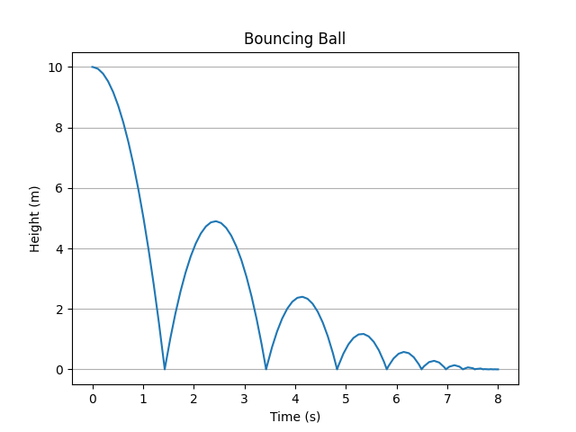

A Bouncing Ball
===============

So far we have only modeled systems without any discontinuities. Now we want to
model a bouncing ball without explicitly modelling the elasticity of the ball.
To do that, we need to detect when the ball hits the ground and modify its
velocity according to the law of reflection.

After this exercise you will know

- how to describe zero-crossing events, and
- how to update the state as a reaction to such an event.

When not in contact with the ground, our ball at height :math:`h\left(t\right)`
and with velocity :math:`v_y\left(t\right)` will simply be accelerated by
gravity:

.. math::
    \frac{d}{dt} h\left(t\right) &= v_y\left(t\right) \\
    \frac{d}{dt} v_y\left(t\right) &= -g

However, once we hit the ground, the velocity will change its direction. Also,
its magnitude will be diminished due to friction losses inside the ball, so we
will have the new state and velocity after the bounce to be:

.. math::
    h'\left(t\right) &= \left|h\left(t\right)\right| \\
    v'\left(t\right) &= - \delta \times v\left(t\right)

Here, :math:`\delta` is the coefficient of restitution.

We define the time when the ball hits the ground as the time when
:math:`h\left(t\right)=0`. Put another way, the event occurs as
:math:`h\left(t\right)` crosses the zero. This is why we call this a
*zero-crossing event*.

Let's define our system and our states first:

.. code-block:: python

    import numpy as np
    import matplotlib.pyplot as plt

    from modypy.model import System, State, ZeroCrossEventSource
    from modypy.simulation import Simulator

    # The system parameters
    DELTA = 0.7
    G = 9.81

    # The initial conditions
    INITIAL_HEIGHT = 10.0
    INITIAL_VELOCITY = 0.0

    # The system
    system = System()

    # The system states
    def height_dt(data):
        return data.states[velocity]

    def velocity_dt(data):
        return -G

    height = State(system,
                   derivative_function=height_dt,
                   initial_condition=INITIAL_HEIGHT)
    velocity = State(system,
                     derivative_function=velocity_dt,
                     initial_condition=INITIAL_VELOCITY)

So far, there is not much difference to the previous examples. But now we define
our bounce-event:

.. code-block:: python

    # Define the zero-crossing-event
    def bounce_event_function(data):
        return data.states[height]

    bounce_event = ZeroCrossEventSource(system,
                                        event_function=bounce_event_function,
                                        direction=-1)

The function ``bounce_event_function`` is defined in such a way so that its
value changes its sign exactly when our ball hits the ground (we assume that our
ball is infinitely small -- we do physics after all).

The parameter ``direction`` tells the simulator that only changes from positive
to negative sign should be considered. Sign changes in the opposite directions
would not be considered. However, as our ball is falling down all the time, it
does not make much of a difference.

Adding this event source to our system instructs the simulator to observe the
value of the event function over time and to take special note of when its value
changes sign. However, we can do more:

.. code-block:: python

    # Define the event-handler
    def bounce_event_handler(data):
        data.states[height] = np.abs(data.states[height])
        data.states[velocity] = -DELTA*data.states[velocity]

    bounce_event.register_listener(bounce_event_handler)

The function ``bounce_event_handler`` applies exactly that change to our state
which we described above by changing the sign and the magnitude of the velocity.
In addition, it will ensure that the height is non-negative. We do this to
avoid a continuing stream of zero-crossings due to numerical inaccuracies.

Now we can run a simulation again:

.. code-block:: python

    # Run a simulation
    simulator = Simulator(system,
                          start_time=0.0)
    msg = simulator.run_until(time_boundary=10.0)

    if msg is not None:
        print("Simulation failed with message '%s'" % msg)
    else:
        # Plot the result
        plt.plot(simulator.result.time,
                 simulator.result.state[:, height.state_slice])
        plt.title("Bouncing Ball")
        plt.xlabel("Time")
        plt.savefig("04_bouncing_ball_simulation.png")
        plt.show()

The resulting plot is shown in :numref:`bouncing_ball_simulation`. As you can
see, our ball bounces happily.

.. _bouncing_ball_simulation:

    Bouncing ball simulation
