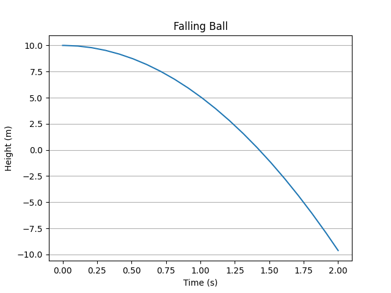

Zero-Crossing Events: A Bouncing Ball
=====================================

So far we have only modeled systems without any discontinuities.
Now we want to model a bouncing ball without explicitly modelling the elasticity
of the ball.
To do that, we need to detect when the ball hits the ground and modify its
velocity according to the law of reflection.

After this exercise you will know

- how to describe zero-crossing events, and
- how to update the state as a reaction to such an event.

Deriving the Equations
----------------------

:numref:`bouncing_ball` illustrates the setup:
We have a ball of a given mass :math:`m` --- which will be inconsequential ---
moving vertically.
Its height above the ground shall be :math:`h\left(t\right)` and its velocity
shall be designated :math:`v_y\left(t\right) := \frac{d}{dt} h\left(t\right)`.

.. _bouncing_ball:
.. figure:: 04_bouncing_ball.svg
    :align: center
    :alt: Falling Ball Setup

    Falling Ball Setup

When not in contact with the ground, our ball will simply be accelerated by
gravity:

.. math::
    \frac{d}{dt} h\left(t\right) &= v_y\left(t\right) \\
    \frac{d}{dt} v_y\left(t\right) &= -g

However, once we hit the ground, the velocity will change its direction.
Also, its magnitude will be diminished due to friction losses inside the ball,
so we will have the new velocity after the bounce as follows:

.. math::
    v\left(t^+\right) = - \delta \times v\left(t^-\right)

Here, :math:`\delta` is the coefficient of restitution.

We define the time when the ball hits the ground as the time when the sign of
:math:`h\left(t\right)` changes from positive to negative, i.e., when it
crosses zero while decreasing.
This is why we call this a *zero-crossing event*.

Defining our System
-------------------

Let's define our system and our states first:

.. code-block:: python

    import matplotlib.pyplot as plt

    from modypy.blocks.linear import integrator
    from modypy.model import System, State, ZeroCrossEventSource
    from modypy.simulation import Simulator, SimulationResult

    # The system parameters
    DELTA = 0.7
    G = 9.81

    # The initial conditions
    INITIAL_HEIGHT = 10.0
    INITIAL_VELOCITY = 0.0

    # The system
    system = System()

    # The system states
    def velocity_dt(system_state):
        """Calculate the derivative of the vertical speed"""
        return -G

    velocity = State(system,
                     derivative_function=velocity_dt,
                     initial_condition=INITIAL_VELOCITY)
    height = integrator(system,
                        input_signal=velocity,
                        initial_condition=INITIAL_HEIGHT)

So far, there is not much difference to the previous examples.
Let's try and run a quick simulation:

.. code-block:: python

    # Run a simulation
    simulator = Simulator(system=system,
                          start_time=0,
                          max_step=0.1)
    result = SimulationResult(system=system)
    result.collect_from(simulator.run_until(time_boundary=2))

    # Plot the simulation result
    plt.plot(result.time, height(result))
    plt.xlabel("Time (s)")
    plt.ylabel("Height (m)")
    plt.title("Falling Ball")
    plt.grid(axis="y")
    plt.savefig("04_bouncing_ball_no_event.png")

The resulting plot is shown in :numref:`bouncing_ball_no_event`.
The ball keeps falling and falls through the ground --- not unexpectedly, as
there is nothing in our model that would keep it from doing so.

.. _bouncing_ball_no_event:

    Falling ball simulation

Adding the Bounce-Event
-----------------------
To change that, we add an event to detect hitting the ground:

.. code-block:: python

    # Define a zero-crossing event for the height
    bounce_event = ZeroCrossEventSource(system,
                                        event_function=height,
                                        direction=-1)

This event will occur whenever the height changes sign from positive to
negative, which is exactly the point where our ball hits the ground (we assume
that our ball is infinitely small --- we do physics after all).
Note that you use any callable as an event function, given that it accepts a
single system state object as parameter.
This is the case for signals and states, so these can be used directly.

The parameter ``direction`` tells the simulator that only changes from positive
to negative sign should be considered.
Sign changes in the opposite directions would not be considered.

Adding this event source to our system instructs the simulator to observe the
value of the event function over time and to take special note of when its value
changes sign. However, we can do more:

.. code-block:: python

    # Define the event-handler
    def bounce_event_handler(data):
        """Reverse the direction of motion after a bounce"""
        velocity.set_value(data, -DELTA*velocity(data))

    # Register it with the bounce event
    bounce_event.register_listener(bounce_event_handler)

The function ``bounce_event_handler`` will change the sign and the magnitude of
the velocity state, as described above.

Running the Simulation
----------------------

Now we can run a simulation again:

.. code-block:: python

    # Run a simulation
    simulator = Simulator(system,
                          start_time=0.0,
                          max_step=0.1)
    result = SimulationResult(system,
                              simulator.run_until(time_boundary=8))

    # Plot the result
    plt.plot(result.time, height(result))
    plt.title("Bouncing Ball")
    plt.xlabel("Time")
    plt.savefig("04_bouncing_ball_simulation_full.png")
    plt.show()

The resulting plot is shown in :numref:`bouncing_ball_simulation`.
As you can see, our ball bounces happily.

.. _bouncing_ball_simulation:
.. figure:: 04_bouncing_ball_simulation.png
    :align: center
    :alt: Results of bouncing ball simulation

    Bouncing ball simulation

Extending the Run Time: Too Many Events
---------------------------------------
What happens if we extend the run-time of the simulation to 10 time units?
We will get an :class:`modypy.simulation.ExcessiveEventError` exception.
This is because, as the ball loses energy, its impacts on the ground will become
more and more frequent, and keep the simulation from progressing.

This is called
`Zeno-behaviour <https://en.wikipedia.org/wiki/Hybrid_system#Bouncing_ball>`_
and is an important problem in the simulation of systems with discontinuities.
