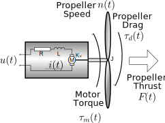
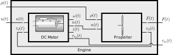
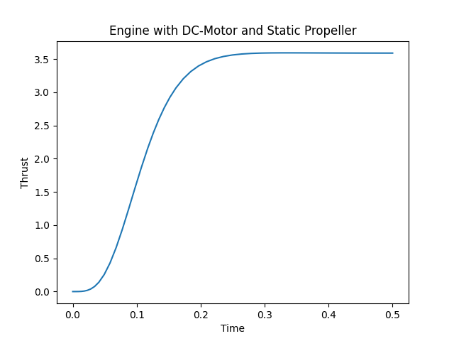

Ports and Blocks: A DC-Motor with Propeller
===========================================

.. contents::

Until now, we have created our states individually and referenced them directly.
However, in practical simulation you might want to define reusable building
blocks and connect their inputs and outputs dynamically.

For example, when analysing
`multicopter dynamics <https://en.wikipedia.org/wiki/Quadcopter>`_ we might want
to have a reusable block for an engine consisting of a DC-motor and a propeller.
We might want to provide individual voltages to individual motors and use an
atmospheric model to determine the density of the air based on altitude.
We might want to sum up the thrust and torque generated by the engines to
determine the total force and torque acting on the multicopter and finally feed
that into some reusable block for rigid-body motion.

In this example, we will define re-usable building blocks for a DC-motor and a
propeller, and assemble them to a DC-engine. We will then simulate a step-
response of such a motor and plot the results.
At the end of this exercise, you will know

- how to define ports as placeholders for signals,
- how to connect ports to signals,
- how to define reusable building blocks for systems, and
- how to use :class:`signal states <modypy.model.states.SignalState>`.

The Engine Model
----------------

The schematic of the engine is shown in :numref:`dc_engine_schematic`.

.. _dc_engine_schematic:

    DC-Engine Schematic

A DC motor converts electrical energy to mechanical energy by inducing a
magnetic field, which interacts with an already existing field generated by a
set of permanent magnets.
We will skip the details of the actual derivations here, and go straight to the
dynamics equations.

We have two state variables for the motor, with one being the angular velocity
:math:`\omega\left(t\right)` and the other being the current flowing through
the coil :math:`i\left(t\right)`.
Their dynamics can be expressed this way:

.. math::
    \frac{d}{dt} i\left(t\right) &=
    \frac{u\left(t\right) - K_v \omega\left(t\right) - R i\left(t\right)}{L} \\
    \frac{d}{dt} \omega\left(r\right) &=
    \frac{K_v i\left(t\right) - \tau_d\left(t\right)}{J}

Here, :math:`K_v`, :math:`R`, :math:`L` and :math:`J` are the motor constant,
the internal resistance and inductance of the motor as well as the moment of
inertia of the motor load.
Further, :math:`u\left(t\right)` is the input voltage and
:math:`\tau_d\left(t\right)` is the load torque.

The second part of our engine is the propeller, which will produce the load
torque, but also thrust, both of which depend on the propeller speed.
We will use a static propeller model, as we will assume that the forward
velocity of our engine through the air is small compared to the velocity of our
propeller tips.

Our propeller has no internal state, it just generates thrust and requires
torque to overcome it aerodynamic drag. The formulae for this are given as
follows:

.. math::
    F\left(t\right) &= c_t \rho D^4 n\left(t\right)^2 \\
    \tau_d\left(t\right) &= \frac{c_p}{2 \pi} \rho D^5 n\left(t\right)^2

These formulae are derived from the
`standard propeller formulae
<https://m-selig.ae.illinois.edu/props/propDB.html>`_, which specify thrust and
power based on

- the thrust coefficient :math:`c_t`,
- the power coefficient :math:`c_p`, and
- the diameter :math:`D` of the propeller.

As parameters, the rotation speed :math:`n\left(t\right)` and the air density
:math:`\rho` are required.
Note that the rotational speed and the angular velocity are related by
:math:`\omega\left(t\right) = 2 \pi n\left(t\right)`.

Defining our System
-------------------

We will now define an engine block, which in turn contains a DC motor and a
propeller block, as shown in :numref:`dc_engine_blocks`.

.. _dc_engine_blocks:

    DC-Engine Blocks

Again, we start by importing everything we need:

.. code-block:: python

    import numpy as np
    import matplotlib.pyplot as plt

    from modypy.model import System, SignalState, Block, Port, signal_method
    from modypy.blocks.sources import constant
    from modypy.simulation import Simulator, SimulationResult

A DC-Motor Block
^^^^^^^^^^^^^^^^

Now, let us define a block for this DC-motor.
We do that by subclassing :class:`modypy.model.Block`.
In the constructor, we first store all the model parameters, such as the motor
constant or the inductance.

.. code-block:: python

    class DCMotor(Block):
        """A block describing a DC-motor"""

        def __init__(self,
                     parent,
                     motor_constant,
                     resistance,
                     inductance,
                     moment_of_inertia,
                     initial_speed=None,
                     initial_current=None):
            Block.__init__(self, parent)
            self.motor_constant = motor_constant
            self.resistance = resistance
            self.inductance = inductance
            self.moment_of_inertia = moment_of_inertia

In the next step, we create our states:

.. code-block:: python

        # Create the velocity and current state
        # These can also be used as signals which export the exact value of
        # the respective state.
        self.omega = SignalState(self,
                                 derivative_function=self.omega_dt,
                                 initial_condition=initial_speed)
        self.current = SignalState(self,
                                   derivative_function=self.current_dt,
                                   initial_condition=initial_current)

There are three major difference to what we did earlier when defining states:

- Instead of :class:`modypy.model.states.State` instances we use
  :class:`modypy.model.states.SignalState` instances.
  These are states which also double as signals, and thus can also be connected
  to ports, as we will see in a later step.
- The first parameter to the constructor is now the instance of the block
  instead of the system.
  This first parameter is the *owner* of the state or signal and both the
  system and blocks may be owners of states and signals.
- As derivative function we specify *bound object methods*.
  These have access any instance variables, such as our model parameters as well
  as the states, signals and ports we declared.

We need some way to determine the input voltage and the external load
acting on the motor axle.
We do that by introducing two :class:`Port <modypy.model.ports.Port>` instances.
Ports are place-holder objects that can be connected to signals.
We will use them to access the value of whatever signal will be connected to
them later.

.. code-block:: python

        # Create (input) ports for voltage and external torque load
        self.voltage = Port()
        self.external_torque = Port()

What is missing are the definitions of the derivative functions and the signal
values:

.. code-block:: python

    def omega_dt(self, data):
        """Calculate the derivative of the angular velocity"""

        return ((self.motor_constant * self.current(data)
                 - self.external_torque(data)) /
                self.moment_of_inertia)

    def current_dt(self, data):
        """Calculate the derivative of the coil current"""

        return ((self.voltage(data)
                 - self.resistance * self.current(data)
                 - self.motor_constant * self.omega(data)) /
                self.inductance)

Finally we define some additional output signals of the block:

.. code-block:: python

    @signal_method
    def speed_rps(self, data):
        """Calculate the rotational velocity in rotations per second"""

        return self.omega(data) / (2 * np.pi)

    @signal_method
    def torque(self, data):
        """Calculate the total torque generated by the motor"""

        return self.motor_constant * self.current(data)

While the state ``omega`` holds the angular speed in radians per time-unit
(usually: seconds), the ``speed_rps`` signal provides it in revolutions per
time-unit.
In addition, we provide the total torque generated by the motor.
This is the torque that acts on the motor mount and thereby on the frame.

We use the :func:`modypy.model.ports.signal_method <signal_method>` decorator
to convert the methods to signals.
If we have an instance `motor` of our `DCMotor` class, `motor.speed_rps` will
be a `Signal` instance representing the speed.
That signal will be unique for the `DCMotor` instance, and will not change over
the lifetime of the latter.

Note that we did not have to define signal output functions for our states
``omega`` and ``current``.
That work is done for us by using the :class:`modypy.model.states.SignalState`
class.

A Static Propeller Model
^^^^^^^^^^^^^^^^^^^^^^^^

So, we define our static propeller block:

.. code-block:: python

    class Propeller(Block):
        """A block representing a static propeller"""

        def __init__(self,
                     parent,
                     thrust_coefficient,
                     power_coefficient,
                     diameter):
            Block.__init__(self, parent)
            self.thrust_coefficient = thrust_coefficient
            self.power_coefficient = power_coefficient
            self.diameter = diameter

            # Define the input ports for propeller speed and air density
            self.speed_rps = Port()
            self.density = Port()

        @signal_method
        def thrust(self, data):
            """Calculate the thrust force of the propeller"""

            rho = self.density(data)
            n = self.speed_rps(data)
            return self.thrust_coefficient * rho * self.diameter ** 4 * n ** 2

        @signal_method
        def torque(self, data):
            """Calculate the drag torque of the propeller"""

            rho = self.density(data)
            n = self.speed_rps(data)
            return self.power_coefficient / (2 * np.pi) * \
                rho * self.diameter ** 5 * n ** 2

The block does not have any states, so it is static, but we still use a block
for it to encapsulate the parameters of the propeller.

Building an Engine Block
^^^^^^^^^^^^^^^^^^^^^^^^

Finally, let us assemble an engine block from our motor and our propeller.
The engine block shall provide thrust and total torque of the engine as outputs
and accept the voltage and the air density as inputs.
We will interconnect the DC-motor and the propeller internally, by providing the
speed of the DC-motor to the propeller as its turning speed and by providing the
torque load of the propeller as external load to the DC-motor.

For our engine block, we first create the elements --- the motor and the propeller
--- and make everything visible to the outside that needs to be:

.. code-block:: python

    class Engine(Block):
        """A block defining an engine consisting of a DC motor and a propeller"""

        def __init__(self,
                     parent,
                     thrust_coefficient,
                     power_coefficient,
                     diameter,
                     motor_constant,
                     resistance,
                     inductance,
                     moment_of_inertia):
            Block.__init__(self, parent)

            # Create the DC motor and the propeller
            self.dc_motor = DCMotor(self,
                                    motor_constant=motor_constant,
                                    resistance=resistance,
                                    inductance=inductance,
                                    moment_of_inertia=moment_of_inertia)
            self.propeller = Propeller(self,
                                       thrust_coefficient=thrust_coefficient,
                                       power_coefficient=power_coefficient,
                                       diameter=diameter)

            # We will simply pass through the voltage and density ports of the
            # motor and the propeller
            self.voltage = self.dc_motor.voltage
            self.density = self.propeller.density

            # We also pass on the thrust and the torque of the whole engine
            self.thrust = self.propeller.thrust
            self.torque = self.dc_motor.torque

Now we need to connect the speed output of the motor to the speed input of the
propeller.
For that, we use the ``connect`` method of the
:class:`Port <modypy.model.ports.Port>` class:

.. code-block:: python

        # The propeller needs to know the speed of the motor axle
        self.dc_motor.speed_rps.connect(self.propeller.speed_rps)

        # The DC-motor needs to know the torque required by the propeller
        self.propeller.torque.connect(self.dc_motor.external_torque)

Now, the ports and signals are properly connected. Finally, it's time to put it
all together.

Putting it all together
^^^^^^^^^^^^^^^^^^^^^^^

What we still need is a way of providing the voltage and the air density.
We will simply use constants for these, which we can create using the
``constant`` function from the :mod:`modypy.blocks.sources` module.

So, let us create our system:

.. code-block:: python

    system = System()
    engine = Engine(system,
                    motor_constant=789.E-6,
                    resistance=43.3E-3,
                    inductance=1.9E-3,
                    moment_of_inertia=5.284E-6,
                    thrust_coefficient=0.09,
                    power_coefficient=0.04,
                    diameter=8*25.4E-3)

    # Provide constant signals for the voltage and the air density
    voltage = constant(value=3.5)
    density = constant(value=1.29)

    # Connect them to the corresponding inputs of the engine
    engine.voltage.connect(voltage)
    engine.density.connect(density)

Note how we use the ``constant`` function to create signals with constant values
for our voltage and density.

Running the Simulation
----------------------

Now, our system is fully assembled. Let's run a simulation:

.. code-block:: python

    # Create the simulator and run it
    simulator = Simulator(system, start_time=0.0, max_step=0.01)
    result = SimulationResult(system,
                              simulator.run_until(time_boundary=0.5))

    # Plot the result
    plt.plot(result.time, engine.thrust(result))
    plt.title("Engine with DC-Motor and Static Propeller")
    plt.xlabel("Time")
    plt.ylabel("Thrust")
    plt.savefig("05_dc_engine_simulation.png")
    plt.show()

That's it!
The result is shown in :numref:`dc_engine_simulation`.

.. _dc_engine_simulation:

    DC-Engine simulation

We can now reuse the blocks that we created in other models and make as many
instances of them as we like.

The Aerodynamics and Electromechanics Block Libraries
-----------------------------------------------------

Besides some very basic blocks such as integrators, sums or gains, MoDyPy also
provides a set of block libraries for special applications, such as the
:mod:`aerodyn <modypy.blocks.aerodyn>` or the :mod:`elmech
<modypy.blocks.elmech>` library, which contain a propeller block that is a bit
more sophisticated than we defined in this example, a :class:`Thruster
<modypy.blocks.aerodyn.Thruster>` and a block for a DC-motor, which can be
easily reused.
