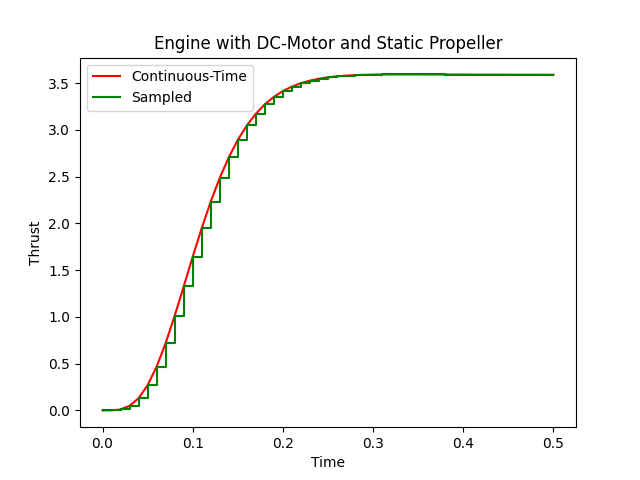

Discrete-Time: Sampling a DC-Engine
===================================

In the previous examples in this guide we only used continuous-time simulation.
However, MoDyPy is also capable of modelling systems that mix continuous-
and discrete-time elements. The discrete-time elements are modelled using clocks
and states that do not have a derivative function, but which are instead updated
as a reaction to events - either from a clock or from a zero-crossing event
source.

In the preceding example we modelled a DC-engine with a propeller. In this
example, we will extend that system by sampling the generated thrust at regular
time intervals. At the end of this exercise you will know

- how to define clocks,
- how to introduce states for discrete-time systems, and
- how to update states when a clock tick occurs.

For this, we will slightly modify the DC-engine example from the previous
exercise. The DC-motor block and the propeller block are also provided as
standard blocks, which we will use in this example.

We again start by importing our required elements:

.. code-block:: python

    import matplotlib.pyplot as plt

    from modypy.model import System, Signal, SignalState, Block, Port, Clock
    from modypy.blocks.aerodyn import Propeller
    from modypy.blocks.elmech import DCMotor
    from modypy.blocks.sources import constant
    from modypy.simulation import Simulator

We will re-use the ``Engine`` class as well as the system definition from the
previous exercise:

.. code-block:: python

    class Engine(Block):
        # ...

    # Create the system and the engine
    system = System()
    engine = Engine(system,
                    motor_constant=789.E-6,
                    resistance=43.3E-3,
                    inductance=1.9E-3,
                    moment_of_inertia=5.284E-6,
                    thrust_coefficient=0.09,
                    power_coefficient=0.04,
                    diameter=8*25.4E-3)

    # Provide constant signals for the voltage and the air density
    voltage = constant(system, value=3.5)
    density = constant(system, value=1.29)

    # Connect them to the corresponding inputs of the engine
    engine.voltage.connect(voltage)
    engine.density.connect(density)

Now, we define a state for keeping the last sampled value of the thrust signal:

.. code-block:: python

    # Set up the state for keeping the sampled value.
    sample_state = SignalState(system)

Note how we did not specify a derivative function for this state. Internally,
this is modelled as the derivative function being a constant zero, i.e. the
state does not change over time.

However, we want our state to change, but we want it to change at specific,
periodic events. For this, we first declare a clock, that will deliver such a
stream of periodic events:

.. code-block:: python

    # Create a clock for sampling at 100Hz
    sample_clock = Clock(system, period=0.01)

Finally, we define a function that updates our sampling state from the
sampled signal, and we register that function as an event handler on the clock:

.. code-block:: python

    # Define the function for updating the state
    def update_sample(data):
        data.states[sample_state] = data.signals[engine.thrust]

    # Register it as event handler on the clock
    sample_clock.register_listener(update_sample)

Our system is now fully defined. Now we want to run a simulation of it and plot
the results:

.. code-block:: python

    # Create the simulator and run it
    simulator = Simulator(system, start_time=0.0)
    msg = simulator.run_until(time_boundary=0.5)

    if msg is not None:
        print("Simulation failed with message '%s'" % msg)
    else:
        # Plot the result
        plt.plot(simulator.result.time,
                 simulator.result.signals[:, engine.thrust.signal_slice],
                 'r',
                 label="Continuous-Time")
        plt.step(simulator.result.time,
                 simulator.result.signals[:, sample_state.signal_slice],
                 'g',
                 where="post",
                 label="Sampled")
        plt.title("Engine with DC-Motor and Static Propeller")
        plt.legend()
        plt.xlabel("Time")
        plt.ylabel("Thrust")
        plt.savefig("06_dc_engine_sampling.png")
        plt.show()

The result is shown in :numref:`dc_engine_sampling`.

.. _dc_engine_sampling:

    DC-Engine simulation with discrete-time sampling

There are many possibilities for defining clocks. Multiple clocks may have
different periods, or they may have the same period but be offset against each
other, they may only run until a specific point in time and then stop. Have a
look at :class:`modypy.model.events.Clock` to find out about all the
possibilities.

Also, the quicker way of introducing a so-called zero-order hold element as we
did here is using the :func:`modypy.blocks.discrete.zero_order_hold` function.
