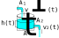

Steady-State: A Water Tank
==========================

Besides simulation, another interesting application is steady state
determination.
A steady state is a condition for a dynamical system where the state of the
system does not change with time.
Steady states are important for designing linear controllers for non-linear
systems, as the knowledge of a steady state allows to create a linear
approximation of the system around that steady state and based on that to create
a linear controller.

In this example we will model the outflow from a water tank and determine the
amount of inflow necessary to keep the height at a specific level.
After this example you will know

- how to explicitly model inputs to a system, and
- how to use the steady-state determination functionality of MoDyPy to find a
  steady state that fulfills a given set of constraints.

A Water Tank
------------

We will model a water tank with an inflow and an outflow, as shown in
:numref:`tank_flow`.
The tank has a cross section area of :math:`A_t`.
An inflow with a cross section of :math:`A_1` provides incoming water at a
velocity of :math:`v_1\left(t\right)` and the current fill height of the tank is
:math:`h\left(t\right)`.
As a consequence of the pressure of the water, the water flows out of the tank
through an outflow with cross section :math:`A_2` at a velocity of
:math:`v_2\left(t\right)`.

.. _tank_flow:

    Tank with inflow and outflow

According to `Toricelli's Law
<https://en.wikipedia.org/wiki/Torricelli%27s_law>`_, we know that

.. math::
    v_2\left(t\right) = \sqrt{2 g h\left(t\right)}

Thus, we can describe the change in height :math:`\dot{h}\left(t\right)` as
follows:

.. math::
    \dot{h}\left(t\right) =
    \frac{A_1 v_1\left(t\right) - A_2 \sqrt{2 g h\left(t\right)}}{A_t}

Setting that to zero, we can derive that a constant inflow of

.. math::
    v_1\left(t\right) = \sqrt{2 g h_0} \frac{A_2}{A_1}

is required to keep a steady height.
However, we will now determine this numerically.

Defining the System
-------------------

First, we will import all the necessary declarations, define some constants and
create a new system:

.. code-block:: python

    # Constants
    G = 9.81    # Gravity
    A1 = 0.01   # Inflow cross section
    A2 = 0.02   # Outflow cross section
    At = 0.2    # Tank cross section
    TARGET_HEIGHT = 5

    # Create a new system
    system = System()

In our problem, the inflow velocity is an input that may have to be determined
as part of the steady-state determination.
In order for the steady-state determination algorithm to recognize it as an
input it can modify, we declare it as an
:class:`InputSignal <modypy.model.ports.InputSignal>`.

.. code-block:: python

    inflow_velocity = InputSignal(system)

Now we can define our fill height as a state:

.. code-block:: python

    def height_derivative(system_state):
        """Calculate the time derivative of the height"""

        return (A1*inflow_velocity(system_state)
                - A2*np.sqrt(2*G*height_state(system_state)))/At

    height_state = SignalState(system, derivative_function=height_derivative)

Defining the Steady State
-------------------------

Our steady state is characterized by three properties:

- the derivative of the state is zero, i.e. the state would not change over
  time,
- the inflow is non-negative, and
- the height equals `TARGET_HEIGHT`.

To tell the steady-state algorithm about these constraints, we define a
:class:`SteadyStateConfiguration <modypy.steady_state.SteadyStateConfiguration>`
instance.
This instance is automatically configured in such a way that the algorithm
searches for a state in which the state derivative is zero.
If we wanted, we could change that by assigning `False` to the respective
entries of the `steady_states` property of the configuration object.

To constrain the height we define lower and upper bounds for the value of the
`height` state.
Similarly, we can specify a lower bound for the inflow input.

.. code-block:: python

    steady_state_config = SteadyStateConfiguration(system)
    # Enforce the inflow to be non-negative
    steady_state_config.input_bounds[inflow_velocity.input_slice, 0] = 0
    # Enforce the height to equal the target height
    steady_state_config.state_bounds[height_state.state_slice] = TARGET_HEIGHT

Now our system including its constraints and inputs is defined and we can run
the steady-state algorithm.
The algorithm returns an :class:`OptimizeResult <scipy.optimize.OptimizeResult>`
object showing whether the search converged and if so, providing the state and
the input vector which satisfy our constraints.

We will print these together with the theoretical steady state of our system:

.. code-block:: python

    result = find_steady_state(steady_state_config)
    print("Target height: %f" % TARGET_HEIGHT)
    print("Steady state height: %f" % height_state(result.system_state))
    print("Steady state inflow: %f" % inflow_velocity(result.system_state))
    print("Steady state height derivative: %f" % height_derivative(result.system_state))
    print("Theoretical steady state inflow: %f" % (
        np.sqrt(2*G*TARGET_HEIGHT)*A2/A1
    ))

Running this code should give us the following output:

.. code-block::

    Target height: 5.000000
    Steady state height: 5.000000
    Steady state inflow: 19.809153
    Steady state derivative: [3.22346662e-06]
    Theoretical steady state inflow: 19.809089

We see that the determined and the theoretical inflow coincide and that the
height is at the target that we want it to be.
Playing around with the target height we get different values:

.. code-block::

    Target height: 7.000000
    Steady state height: 7.000000
    Steady state inflow: 23.439796
    Steady state derivative: [6.82950784e-05]
    Theoretical steady state inflow: 23.438430
